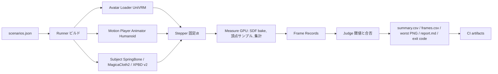

# Yurecheck 設計(v1)

正本はこのファイル。採らなかった案と理由は docs/adr/、用語は docs/CONTEXT.md、指標の定義は docs/METRICS.md(メンテナが書く)。

## 要点

- 固定ステップ(Time.captureDeltaTime = 1/60)で回し、同じ入力から同じ数字が出ることを先に取る。処理時間は別の時計で測る。
- 計測は CPU の参照実装から始め(v1 の頂点数なら間に合う見込み)、時間が足りないときだけ GPU の compute に移す。GPU に移しても CPU に戻すのはフレームごとの集計値だけにし、全頂点の読み戻しで 3fps に落ちた 前身の実装の失敗を避ける(2026-10-07 改訂)。
- 貫通は「距離は SDF、符号は VRM のコライダー」の併用。開いたメッシュで符号が壊れる問題の退路。
- 被検体は ISubject の差し替え。v1 は VRM SpringBone(基準線)と MagicaCloth 2(任意依存、ソース非公開)。v2 の XPBD も同じ口から入る。
- 判定対象の頂点は「揺れものの関節にウェイトを持つ頂点」で自動に決める。キャラ固有の名前の決め打ちを持たない。
- 無人実行は Windows のビルドに引数を渡して CSV・PNG・終了コードを返す。CI は自 PC の self-hosted runner を対話セッションのプロセスとして動かす。

## 本文

### 1 全体像



1シナリオ = アバター × モーション × 被検体 × 設定。ランナーはシナリオ一覧を順に回し、1シナリオごとに結果を書き出す。

### 2 固定の決め事と理由

| 決め事 | 理由 |
|---|---|
| 固定ステップ。Time.captureDeltaTime = 1/60、VSync 無効、乱数の種固定 | 実時間に依存しない。機械の速さが変わっても同じ軌道になり、CSV の md5 で決定性を確かめられる。前身の実装(可変 dt、決定性未確認)の反省 |
| 処理時間は別の時計 | 固定ステップにすると deltaTime は実時間でなくなる。CPU は Stopwatch と ProfilerRecorder、GPU は FrameTimingManager の GPU フレーム時間で、どちらも実時間を読む |
| 計測は CPU の参照実装から。GPU は必要になってから | まず CPU(Burst)で全指標を実装し、これをテストの正解にする。走らせて 1 時間の予算に収まらないときだけ、同じ式を compute shader に移す。GPU に移すときも CPU に戻すのは集計値だけ。前身の実装は全粒子を毎フレーム読み戻して 3.1fps に落ちた(理由は docs/adr/0004) |
| SDF は低解像度で毎フレーム焼く | MeshToSDFBaker を 64³ でアバターの包囲箱に対して焼く。公式も「毎フレームなら低解像度」と書く。体のメッシュは BakeMesh で姿勢を取る |
| 符号はコライダー、距離は SDF | VRoid の体は首や手首で開いている可能性があり、flood fill の符号が壊れる(前身の実装で偽陰性)。VRM 1.0 の SpringBone コライダー(球・カプセル)の和で内外を決め、SDF は距離だけに使う。コライダーの無い部位(股下)は SDF の符号に退く |
| 被検体はソルバ非依存の ISubject | Attach(avatar)、Reset()、Step(dt)、Name、Params。SpringBone は UniVRM の手動更新(UpdateType None と ManualUpdate)、MagicaCloth 2 は MAGICACLOTH2 の記号で #if に包み、asmdef の versionDefines で任意依存にする。リポジトリは MC2 無しでもビルドできる |
| 判定対象の頂点は自動 | VRM の SpringBone の関節にスキンウェイトを持つ頂点を「揺れもの頂点」、持たない頂点を「体」とする。MC2 でも同じ頂点集合を使い、被検体間で比較の土俵を揃える |
| 指標は体型で正規化 | 深さは mm と「身長に対する千分率」の両方を出す。閾値は正規化した側で持つ。体型差の相対化は v1 では判定側で行い、設定の相対化は v2 の XPBD で行う |
| 無人実行はビルド | エディタに依存しない。-screen-width 640 -screen-height 360 の小さな窓で描画は残す(-nographics は使わない。SDF と頂点バッファに GPU が要る)。self-hosted runner はサービスではなく対話セッションのプロセスとして起動する(D3D12 の描画のため) |
| 失敗フレームだけ画像を残す | 閾値を超えた瞬間だけ RenderTexture を読み戻して PNG にする。動画は範囲外(必要なら ffmpeg で後処理) |
| 間違った書き方ができない構造にする(2026-10-07) | 規則を人の注意ではなく型と構造に持たせる。例: 深さは `Millimeters` と `PermilleOfHeight` を別の型にして混ぜられなくする。閾値は正規化した型しか受け取らない。`FrameRecord` は生成後に変更できない。ランナーの段階は状態の型で表し、テスト未実施の状態から PR を作る関数が存在しない。`ISubject` は Attach の後にしか Step を呼べない契約にする。「不正な状態を表現できなくする」設計の考え方 |

### 3 構成要素

| 要素 | 責務 | 書く人 | テスト |
|---|---|---|---|
| Scenario | scenarios.json の読み込み、展開(直積)、検証 | AI、メンテナが読む | 単体(不正な JSON を弾く) |
| AvatarLoader | VRM 1.0 の読み込み、Humanoid、揺れもの頂点集合の抽出、身長の取得 | AI 下書き、メンテナが頂点集合の規則を書く | 単体(ダミー VRM で頂点集合が合う) |
| MotionPlayer | CC0 クリップの Humanoid リターゲット再生、ループ、合成モーション(テレポート、急停止、高速移動) | AI | PlayMode(ループ境界で root が跳ぶ) |
| ISubject と実装2つ | 被検体の付け外し、手動ステップ、設定の適用 | メンテナ(SpringBone の更新順はメンテナが理解して書く) | PlayMode(2回の実行で CSV の md5 一致) |
| Stepper | 固定 dt の進行、ウォームアップ、ループ回数、更新順(Animator → Subject → Measure) | メンテナ | PlayMode |
| SdfBaker | 体の BakeMesh、MeshToSDFBaker 64³、コライダーの和の符号 | AI 下書き、メンテナが符号の規則を書く | 単体(球の SDF で既知の距離) |
| Measure(compute) | 頂点サンプル、深さ、速度、二階差分、集計(count、max、sum) | メンテナ(式)、AI(ボイラープレート) | 単体(CPU の参照実装と GPU の結果が誤差内で一致) |
| Judge | 閾値、合否、正規化 | メンテナ | 単体 |
| Writer | CSV、PNG、report.md、終了コード | AI | 単体(列と行数) |
| Build と CLI | BuildScript、引数、ログ | AI | PlayMode の最小シナリオ |

### 4 データ形式

scenarios.json(例)。

```json
{
  "dt": 0.016667,
  "loops": 3,
  "warmup_sec": 1.0,
  "avatars": ["avatars/a_tall.vrm", "avatars/b_short.vrm", "avatars/c_longskirt.vrm"],
  "motions": ["motions/walk.fbx", "motions/run.fbx", "motions/squat.fbx", "motions/jump.fbx", "motions/turn.fbx", "synthetic:teleport", "synthetic:stop", "synthetic:fast"],
  "subjects": [
    {"name": "springbone", "params": "default"},
    {"name": "springbone", "params": "presets/booth_auto.json"},
    {"name": "magicacloth2", "params": "presets/mc2_default.json"}
  ],
  "thresholds": "thresholds.json"
}
```

summary.csv の列。1行 = 1シナリオ。

```
scenario_id, avatar, motion, subject, params, frames,
pen_rate, pen_p99_mm, pen_p99_permille, pen_max_mm,
div_nan, div_vmax_mps, div_aabb_ratio,
jit_flips_per_s, jit_hf_ratio,
cpu_step_ms_mean, cpu_step_ms_p99, gpu_frame_ms_delta,
determinism_md5, pass, fail_reasons
```

frames.csv は任意(--frames で出す)。1行 = 1フレーム、列は上の指標のフレーム値。

report.md の構成: 走行の条件、シナリオ表(合否と理由)、被検体ごとの比較表、最悪フレームの PNG、決定性の結果、閾値の一覧。

終了コード: 0 = 全部合格、1 = 不合格あり、2 = 実行エラー(読み込み失敗など)。

### 5 指標の定義

記号: 揺れもの頂点 i の位置 x_i(t)、固定 dt、身長 H(VRM の Humanoid の頭頂と足元から)、SDF の距離 d(x)(体の内側で負)。

| 指標 | 定義 | 単位 | 閾値の初期値 | 決め方 |
|---|---|---|---|---|
| 貫通率 pen_rate | d(x_i(t)) < −τ となる (i, t) の割合 | 比 | τ = 0.3% H(身長 1.6m で約 5mm) | 目視と突き合わせる(下記) |
| 貫通深さ pen_p99 | −d の p99(全 i, t) | mm と ‰H | 1% H | 同上 |
| 発散 div | NaN または Inf の有無。max_i |v_i| > v_max。揺れもの頂点の包囲箱の対角が rest の r 倍を超える | 個、m/s、比 | v_max = 20 m/s、r = 3 | 物理の常識から固定(ダンスでも 20 m/s は出ない) |
| ジッタ jit_flips | 静止区間で、各軸の速度の符号が反転したフレームの割合を 1 秒あたりの回数に直したもの(頂点平均) | 回/s | 6 回/s | 合成ケースで校正(1Hz の正弦は低く、15Hz の交互は高く出ることを単体テストで固定) |
| ジッタ jit_hf | 二階差分の大きさの和を一階差分の和で割ったもの(静止区間) | 比 | 補助指標。閾値は持たない | 同上 |
| CPU 時間 cpu_step | Subject.Step の Stopwatch の平均と p99 | ms | 2 ms(配信の 60fps で 16.7ms の 12%) | 予算として固定。根拠は配信の予算 |
| GPU 時間 gpu_delta | FrameTimingManager の GPU フレーム時間を、被検体あり・なしの同じシナリオで引いた差 | ms | 報告のみ(v1 は CPU 被検体) | v2 の XPBD で予算を置く |


目視校正はどこで要るか(2026-10-07): 2つの別の作業に分ける。

- **指標の妥当性の確認(開発者の作業、1回)。** 「この指標は人が気になるものを捉えているか」を確かめる。上の (1)〜(3) がこれで、v1 はメンテナの目で行い、複数人の目は v2 以降に足す。合わない指標は定義を直す。これは道具の品質の話で、利用者ごとには行わない。
- **閾値の決定(利用者の作業、プロジェクトごと)。** 「どこまで許すか」は方針で、見え方も許容も利用者と作品で違う。道具はメンテナの校正から出した既定値を thresholds.json に同梱し、利用者が書き換えられるようにする。加えて、利用者が自分の目で校正できる補助(録画と値の一覧を出し、印を付けた結果から閾値の案を出す `calibrate` の手順)を用意する。v1 は手順書と CSV の雛形まで、補助コマンドは v2。

つまり、ユーザーごとに実施するのは閾値の校正で、指標の妥当性は開発者が1回確かめる。既定値は「メンテナの目で決めた」と明記する。

静止区間の定義: 合成の急停止モーションの保持 3 秒と、クリップ idle の全区間。root の速度が 0.05 m/s 未満の区間を自動で切り出すのは v2。

閾値の決め方(2026-10-07 作り直し): 前の案は「貫通 p99 が大きいほど目に付く」を前提にしていたが、その前提は確かめていない。目に付くかは深さだけでなく、持続時間、部位(顔の近くか裾の下か)、カメラからの見え方、動きの速さで変わり、「気になる」には暴れや硬さも含まれる。そこで順序を逆にする。(1) M2 で 10〜20 シナリオをメンテナが 90 秒の録画で見て、「貫通が気になる」「暴れ・ジッタが気になる」「硬い・不自然」「気にならない」の印を付ける。(2) 指標ごとに、印の群と値の並びがどれだけ一致するかを見る(気になる群と気にならない群の値の重なり)。(3) 一致しない指標は定義を直す(深さに持続時間や部位の重み、可視性を掛ける等)。(4) 一致した指標だけ、群の境界を閾値にする。印と値は docs/thresholds/calibration.md に残し、閾値を目視で決めたことを readme に書く。合わない指標が出ること自体が「覆した既定」の候補になる(p99 の深さは目と合わない、など)。件数の 10〜20 は、印の群が分かれるまで増やす前提の初期値。

### 6 1シナリオの流れ

1. アバターを読み込み、Humanoid を確認し、揺れもの頂点集合と身長を取る。
2. 被検体を付ける(Reset で rest 姿勢)。
3. モーションを Humanoid にリターゲットして Animator に載せる。Root Motion は切る。合成モーションは Animator の外で root を動かす。
4. ウォームアップ 1 秒(計測しない)。
5. 固定 dt で N フレーム進める。各フレームの順序は Animator の更新 → Subject.Step(dt) → 体の BakeMesh と SDF 焼き → compute で計測 → 集計の読み戻し(4 フレーム遅れの GPU 時間は後で揃える)。
6. 閾値超えのフレームは PNG を保存する(同じシナリオで最大 3 枚)。
7. 終了後、summary.csv に 1 行、必要なら frames.csv、決定性は同じシナリオを 2 回回して md5 を比べる(SpringBone のみゲート。MC2 は報告だけ)。

合成モーションの作り方。テレポート: 歩きのループ境界で root を 2m 跳ばす(ループ境界の絡まりの再現)。急停止: 走り 2 秒の後に 3 秒の保持。高速移動: 歩きの root 速度を 3 倍にする。

### 6b 型と層で縛る(2026-10-07 追記)

- 単位: Millimeters と PermilleOfHeight は別の readonly struct。変換は PermilleOfHeight.From(Millimeters, Millimeters height) だけ。Thresholds は PermilleOfHeight しか持たない。
- 境界で parse: scenarios.json と thresholds.json は生の型(ScenarioFile、ThresholdsFile)で読み、Scenario と Thresholds へ1回だけ検証して変換する。以後は検証しない。
- 事実と方針: FrameMetrics(Metrics アセンブリ、不変)と Verdict(Judge アセンブリ)。Output は Verdict を受け取るが作れない。asmdef は Metrics ← Judge ← Output。
- 型状態: IConfiguredRun.WarmUp() → IWarmedRun.Measure(n) → IMeasuredRun.Judge(t) → IReport。SavePng は IReport にしか無く、FailedFrame は Judge が閾値超えのフレームにだけ作る。ISubject は IDetachedSubject.Attach → IAttachedSubject.Step に分ける。
- Unity 6 は C# 9(docs/adr/0017)。揺れにくい中核(docs/adr/0018)(単位、parse、FrameMetrics、Judge、指標の CPU 参照実装)は Yurecheck.Core として .NET Standard 2.1 のライブラリで別にビルドし、現代の C# と dotnet test を使う。Unity 側は DLL を参照して適合層だけを C# 9 で書く。
- Lint: csc.rsp で nullable を有効にし、switch の網羅(CS8509)をエラーにする(csc.rsp で特定警告をエラー化できるかは M0 で確かめる)。BannedSymbols で全頂点の GetData と Runtime の Debug.Log を禁止する(Unity での AdditionalFiles の渡し方は M0 で確かめる)。

### 7 リポジトリと依存

```
yurecheck/
  core/Yurecheck.Core/          中核のライブラリ(docs/adr/0018)。netstandard2.1、Units、Parse、Metrics(FrameMetrics)、Measure/*Reference*.cs(メンテナ)、Judge/(メンテナ)
  core/Yurecheck.Core.Tests/    dotnet test(GitHub-hosted で回る)
  Assets/Yurecheck/Plugins/     Core の DLL と pdb(post-build で写す)
  Assets/Yurecheck/Runtime/     ランナー、ISubject、適合層(頂点の読み出し、SDF、Burst)、出力
  Assets/SwayCheck/Runtime/Subjects/MagicaCloth2/   #if MAGICACLOTH2
  Assets/SwayCheck/Editor/      BuildScript
  Assets/SwayCheck/Tests/EditMode, PlayMode
  Assets/SwayCheck/Shaders/     SDF サンプルと集計の compute
  avatars/                      自作 VRM 3〜5体(利用条件を VRM のメタに書く)
  motions/ ATTRIBUTION.md       CC0 クリップと出どころ
  scenarios/ smoke.json full.json thresholds.json
  presets/                      被検体の設定
  .github/workflows/            smoke.yml nightly.yml
  docs/ README.md README.ja.md AI_USAGE.md METRICS.md
```

依存: Unity 6 LTS(URP)、UniVRM(VRM 1.0、MIT)、VFX Graph(SDF Bake Tool のため。Unity Companion License)、MagicaCloth 2(任意。ソースはリポジトリに入れない)。ライセンスは MIT。他者ライブラリは Packages と別アセンブリに分ける。

### 8 CI

- smoke.yml: push ごとに、ビルド → 1 アバター × 2 モーション × 2 被検体 → summary.csv と report.md を artifact に。失敗の条件は終了コード 2、決定性の不一致、単体テストの失敗。閾値の不合格は smoke では失敗にしない(数字を見るため)。
- nightly.yml: 毎晩 full.json。閾値の不合格を失敗にする。
- self-hosted runner は自 PC。サービス登録ではなく、ログオンした対話セッションでプロセスとして起動する(D3D12 の描画と GPU 時間のため)。手順は docs に書く。
- Unity のビルドは -batchmode -nographics -executeMethod で行う(ビルド自体は描画が要らない)。ランナーの実行は描画あり。

### 9 テスト

- EditMode: 指標の CPU 参照実装に合成データ(球の SDF、NaN 注入、1Hz 正弦、15Hz 交互)を与え、期待値と一致。GPU の compute を同じデータで回し、CPU と誤差 1e-4 以内で一致。Scenario の展開と検証。Writer の列。
- PlayMode: 最小シナリオ(ダミーの VRM、合成モーション、SpringBone)を 2 回回して frames.csv の md5 が一致。テレポートで root が 2m 跳ぶ。閾値超えで PNG が出る。
- 目視校正の記録: M2 で付けた「気になる / 気にならない」の表を docs に残す。

### 10 AI の利用範囲と説明責任

| 部分                                                                   | 書く人                 | 説明の確認                    |
| -------------------------------------------------------------------- | ------------------- | ------------------------ |
| 指標の式、閾値、正規化、符号の規則、更新順                                                | メンテナ                 | メモ無しで式を板書し、単位と閾値の根拠を言える  |
| SpringBone の更新の仕組み(UniVRM の手動更新)、VRM 1.0 の SpringBone の動き方(Verlet 型) | メンテナが読んで要約を docs に書く | 「なぜ Animator の後に呼ぶか」を言える |
| MagicaCloth 2 の仕組みの要約(Job と Burst、CPU、既定 90Hz)                       | メンテナ                 | 公開仕様と自分の計測の差を言える         |
| SDF の焼き方と compute の集計                                                | AI 下書き、メンテナが読んで直す    | 64³ の理由、読み戻しを減らす理由を言える   |
| CLI、JSON、CSV、report、BuildScript、CI の yml                             | AI                  | 動けばよい。readme に AI と書く    |
| テストの雛形                                                               | AI、期待値はメンテナ          | 期待値の根拠を言える               |

AI_USAGE.md に、どの部分を AI が書いたか、どのモデルと道具か、メンテナが何を直したかを残す(AI 利用を明記する慣行に合わせる)。

### 11 マイルストーンとタスク

| 段     | タスク                                                                                                                                                                       | 出るもの          | 学ぶこと                                   |
| ----- | ------------------------------------------------------------------------------------------------------------------------------------------------------------------------- | ------------- | -------------------------------------- |
| M0 基盤 | リポジトリ、LICENSE、Unity 6 LTS + URP + UniVRM + VFX Graph、VRoid で VRM 1.0 を 3 体(高い、低い、長いスカート)、CC0 クリップ 5 本の取得と ATTRIBUTION、Scenario と Writer、BuildScript と CLI、空のシナリオが CSV を書く | 空走するランナー      | VRM 1.0 の構造(Humanoid、SpringBone、コライダー) |
| M1 指標 | 揺れもの頂点集合、SdfBaker、CPU の参照実装で4指標、EditMode テスト、固定ステップと決定性、1 時間の予算に収まるかの計測。収まらなければ compute 版を足す | 合成ケースが全部通る。予算の実測 | SDF、固定ステップの意味、(必要なら)GPU の集計 |
| M2 判定 | SpringBone 被検体、MC2 被検体(#if)、合成モーション、Judge、report.md、PNG、目視校正 10 件、閾値確定                                                                                                    | 最初の「覆した既定」の数字 | SpringBone と MC2 の仕組み                  |
| M3 公開 | smoke と nightly の CI、self-hosted の手順、README 日英、AI_USAGE、METRICS、動画 3〜5 分、実行ファイル                                                                                           | 提出できる形        | 人に説明する練習                        |
| M4 判断 | v2 に入るか(XPBD、Maya 層、自動探索)                                                                                                                                                 |               |                                        |

### 12 リスクと退路

| リスク                            | 退路                                                               |
| ------------------------------ | ---------------------------------------------------------------- |
| VRoid の体が開いていて SDF の符号が壊れる     | コライダーの和で符号を取る(設計に組み込み済み)。それでも駄目なら体を閉じたメッシュに差し替える                 |
| MC2 が決定的でない                    | 決定性のゲートは SpringBone だけ。MC2 は 3 回回して分散を報告する                       |
| FrameTimingManager の GPU 時間が過少 | 差分法で相対値として扱い、絶対値は言わない。v2 で dispatch 単位の計測を足す                     |
| self-hosted runner で描画できない     | 対話セッションのプロセスとして起動。駄目なら CI はビルドと EditMode テストだけにし、ランナーは手動の夜間実行にする |
| CC0 クリップのリターゲットで足が滑る           | 揺れものの判定には影響しない。見た目の動画では idle と歩きだけ使う                             |
| 1 時間の予算を超える                    | 64³ を 48³ に、frames.csv を省略、full を 3 体 × 5 モーション × 2 被検体に固定       |
| メンテナが式を説明できない部分が残る              | その部分は公開物から外すか、docs に「AI が書いた、未理解」と正直に書く                          |
