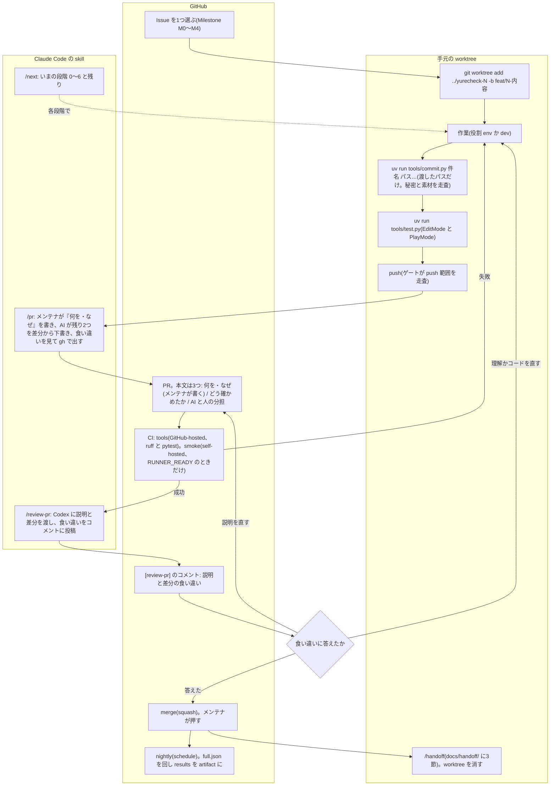

# 作業の流れと、各手順の理由

1 Issue = 1 ブランチ = 1 PR。小さく区切るほど、説明が書けて、レビューが効いて、戻せる。

## 全体の流れ(図)

段階(`/next` が出す): 0 着手前 → 1 作業中(未コミットあり) → 2 テスト(未実行・古い・失敗) → 3 PR 前(未 push、draft も含む) → 4 CI(待ち・失敗) → 5 レビュー(説明が空、[review-pr] 無し、変更要求) → 6 merge 可。6 の条件は「説明をメンテナが書いた」「[review-pr] のコメントがある」「変更要求が無い」「チェックが緑」。

GitHub 側で人が押すのは、Issue を切る、PR を出す(gh 経由)、食い違いに答える、merge、の4つ。それ以外は hook と tools と CI が動く。

| 手順 | やること | なぜ要るか |
|---|---|---|
| 1 Issue | 目的と完了の条件を書く | 「終わった」を先に決めないと、作業が膨らみ PR の説明が書けない |
| 2 ブランチ | `git worktree add ../yurecheck-<番号> -b feat/<番号>-<内容>` | main を汚さない。worktree なら複数の作業を混ぜない。main の保護(直接 push 禁止)が後ろで守る |
| 3 作業とコミット | `uv run tools/commit.py "件名" <パス>...`。渡したパスだけをステージする。件名は「何をしたか」 | コミットが細かいほど、HANDOFF と説明が自動で下書きできる |
| 4 テスト | `uv run tools/test.py`(EditMode と PlayMode)。tools を変えたら `uv run pytest` | テストが通った状態からしか PR を作れない(status が段階 2 で止める) |
| 5 PR | `/pr`。「何を変えたか、なぜ」はメンテナが書き、残り2つは AI が差分から下書きする | 説明を書けないものは理解していない。書くのは AI に任せられない唯一の工程なので、ここだけ人に残す |
| 6 CI と レビュー | smoke が通ったら `/review-pr` | 説明と差分の食い違いを第三者の目で見つける。食い違いは「説明を直す」か「理解を直す」 |
| 7 merge | 食い違いに答えたら、メンテナが merge。worktree を消す | merge の判断が人の工程。CI とレビューは材料 |
| 8 HANDOFF | `/handoff`(hook でも自動) | 次のセッションが「段階と残り」を正しく出すため |

## main の保護(GitHub 側の設定)

- PR を必須にする(直接 push 禁止)。管理者にも適用する。
- ステータスチェックを必須にする。tools と、runner を登録したら smoke。
- 承認(approve)は必須にしない。作者は自分の PR を承認できないので、1人のリポジトリでは誰も merge できなくなる。代わりに `/next` が「説明をメンテナが書いた」「/review-pr のコメントがある」を見て 6 を出す。
- secret scanning と push protection を入れる。fork からの Actions は承認制にする(docs/ops/runner.md)。
- private の間(GitHub Free)は、branch protection も rulesets も secret scanning も使えない。その間の「main に直接 push しない」「秘密を入れない」は、tools/commit.py(main を拒む)、commit と push の前の走査、force push の deny だけが守る。public にした時点で上の設定を入れる。

## 初めてのとき

clone したら uv を入れて `uv sync` し、`uv run tools/doctor.py` で環境を点検します(uv が無い間は `python tools/doctor.py`)。Claude Code なら `/onboarding` が点検から最初の作業までを案内します。

## 手でコミットするとき

Claude を通さず手でコミットするときも同じ検査を通す。初回に `git config core.hooksPath .githooks` を実行する(.githooks/pre-commit が tools/precommit.py を呼ぶ)。

## 役割の切り替え

- 環境を変える(AGENTS.md、.claude/、.github/、tools/、依存、docs/ops/)ときは `claude --settings .claude/settings.env.json`。
- 機能を作るときは `claude --settings .claude/settings.dev.json`。
- 同時に両方を開かない。環境を変えている最中に開発が走ると、巻き込みが起きる。
- 開発の役割が環境に不満を持ったら docs/proposals/ に要件を書く。環境の役割が次の起動で読む。

## 効いているかを確かめる工程

設定や hook は「書いた」と「効いている」が別物になりやすい(別のプロジェクトで、サンドボックスが2日間効いていなかった例がある)。環境を変えたら、次の3つのどれかで1回確かめてから merge する。

- 意図的に違反してみる。開発の役割で .github/ に書こうとして hook が止めるのを見る。
- ログを見る。`claude --debug` で rules の読み込みと hook の実行が出ているか。
- 値を読む。settings の deny が効いているかを、deny に当たるファイルへの Edit を頼んで確かめる。`/permissions` で合成された規則(deny > ask > allow、設定5段の上書き)を見る。

M0 の最初の PR は、この確認の記録(何を試して何が止まったか)を本文に書く。

## 迷ったとき

- 「これは Issue にすべきか」: 1 PR で終わる大きさなら Issue。終わらないなら Milestone に分ける。
- 「環境か開発か」: 書くファイルで決まる(.claude/role_paths.json の env_only)。
- 「メンテナが書くファイルか」: docs/OWNER_WRITTEN.md。hook が止める。
- それ以外は WORKFLOW.md に無い。メンテナが決める。
